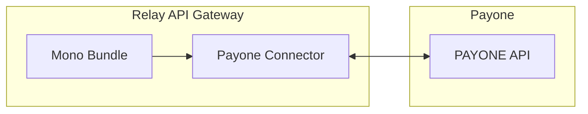

# Mono Payone Connector

Source: https://github.com/digital-blueprint/relay-mono-connector-payone-bundle



The PAYONE Connector connects mono with [PAYONE](https://www.payone.com/).
It allows configuring multiple different payment contracts with PAYONE, each with
different payment methods.

## Bundle installation

You can install the bundle directly from [packagist.org](https://packagist.org/packages/dbp/relay-mono-connector-payone-bundle).

```bash
composer require dbp/relay-mono-connector-payone-bundle
```

## Installation Requirements

* A MySQL/MariaDB database
* (for production use) A contract with [PAYONE](https://www.payone.com/)
* (for production use) A registered webhook with PAYONE

## Documentation

* [Configuration](./config.md)
